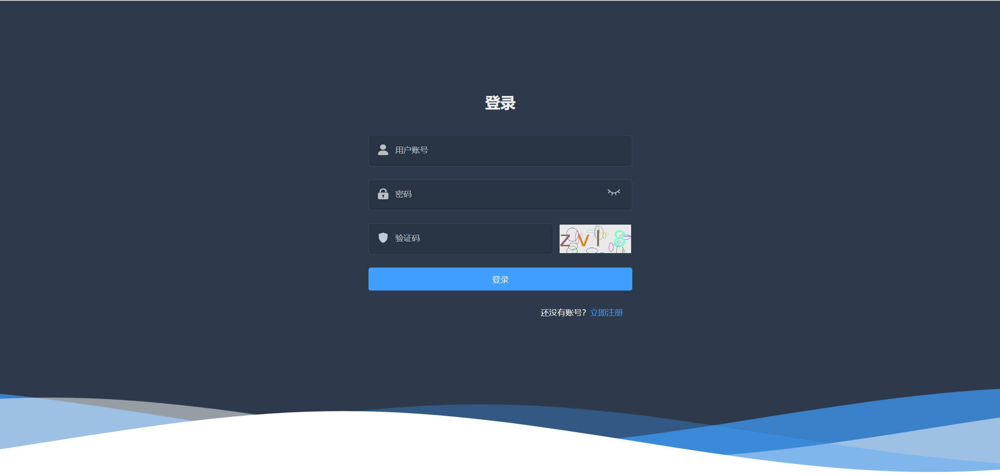
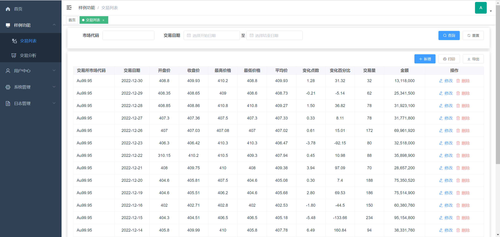
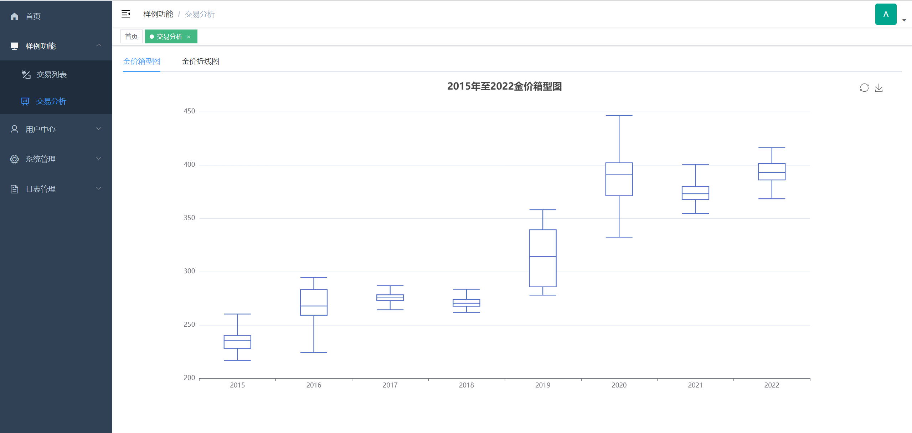
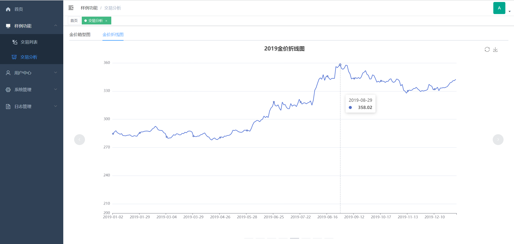
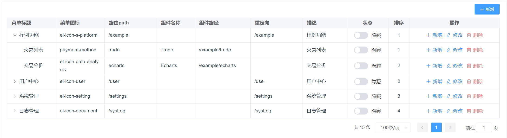
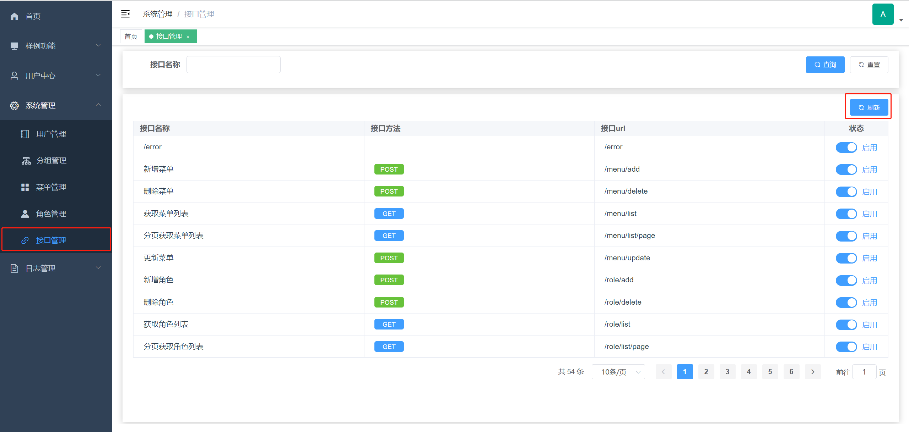

# mbp_front
### 项目简介

mbp是一个管理系统的基础项目模板，其主要作用是提供管理系统的基础功能，使开发者不必再次开发重复的功能，可以更快的进入核心业务的开发。

目前提供了：登录、注册、用户管理、RABC权限管理（用户权限）的基础功能。

样例功能：简单的增删改查、表格导出、表格分页打印、Echats图表。

前端说明：

1.由于作者主后端开发，目前[vue-admin-template](https://github.com/PanJiaChen/vue-admin-template)（当前前端解决方案）基本没有继续更新和维护，该解决方案使用的是vue2，且没有[vue-element-admin](https://panjiachen.gitee.io/vue-element-admin-site/zh/)功能丰富，可能不适合你。

2.升级了[vue-admin-template](https://github.com/PanJiaChen/vue-admin-template)中的[element-ui](https://element.eleme.io/#/zh-CN/component/form)为最新的版本，可以查阅其最新特性来进行使用。

3.修复和微调了很多功能，如果碰到样式无法改变的情况，可能是作者做了全局样式的替换，可在src/styles/element-ui.scss下找到相关修改。

4.后续应该会更换其他的解决方案（2023-08-08）。

采用前后端分离的方案，这里为**前端项目**，前往[后端项目](https://github.com/DY56GO/mbp_back)。





|  |  |
| ------------------------- | ------------------------- |
|  |  |


### 功能列表

- 首页：目前为空白页面，开发者可根据业务需求修改。

- 样例功能：提供一些样例功能。

​			交易列表：一个查询列表展示，其中包括：条件查询、新增、修改、删除、数据导出。

​			交易分析：使用Echarts对交易列表的数据进行可视化，其中包括：箱型图和折线图。

​			（交易数据说明，来源于[和鲸社区](https://www.heywhale.com/home)，数据为2015年至2022年Au99.95（黄金）交易数据）

- 用户中心：提供用户修改自身信息的功能。

​			我的信息：修改用户自身基本信息。

​			修改密码：修改用户自身密码。

- 系统管理：管理员对系统的操作功能。

​			用户管理：管理系统的所有用户，其中包括：条件查询、新增、修改、删除、启用用户，用户权限角色分配。

​			分组管理：管理系统的所有用户组，其中包括：条件查询、新增、修改、删除。

​			角色管理：管理系统的所有权限角色，其中包括：条件查询、新增、修改、删除、启用角色，角色菜单、角色接口的权限分配（可选）。

​			菜单管理：管理系统的所有菜单，其中包括：条件查询、新增、修改、删除、隐藏菜单。

​			接口管理（可选）：管理系统的所有接口，自动获取后台接口信息，可控制接口的开启（系统设置的白名单不受控制）。

- 日志管理：提供系统记录日志的功能，请根据情况选择性使用（开启），特别是请求日志功能，不建议开启，线上的请求会很多。

​			登录日志（可选）：记录登录。

​			请求日志（可选）：记录请求。


### 技术栈

- [vue-admin-template](https://github.com/PanJiaChen/vue-admin-template)（后台前端解决方案）

  ​	axios 0.18.1

  ​	core-js 3.6.5

  ​	element-ui 2.15.13

  ​	js-cookie 2.2.0

  ​	normalize.css 7.0.0

  ​	nprogress 0.2.0

  ​	path-to-regexp 2.4.0

  ​	vue 2.6.10

  ​	vue-router 3.0.6

  ​	vuex 3.1.0


### 本地调试

1.下载源码到本地 。

2.安装依赖，在项目文件下执行安装命令。

3.修改与后台接口的路径，打开文件 .env.development ，修改 VUE_APP_BASE_API 为本地后台地址（例：http://localhost:7529 ）。

4.运行启动命令，在package.json文件中。

相关命名：

```cmd
# 克隆项目
git clone https://github.com/DY56GO/mbp_front.git

# 进入项目目录
cd MBP_FRONT

# 安装依赖
npm install

# 本地调试
npm run dev
```


### 开发上手

这个项目使用的是[vue-admin-template](https://github.com/PanJiaChen/vue-admin-template)，官网会有更加详细的介绍，这里简单的介绍怎么开发上手，抛开其他功能（登录Token

、动态路由、页面水印等），先简单的开发一个可以和后台交互的页面，主要是src目录下api和views，api为后台请求接口，views为页面，可以仿照样例功能进行开发上手，注意在编写页面的时候组件名称应为大写开头。

| 描述                                                         | 图片                                                         |
| ------------------------------------------------------------ | ------------------------------------------------------------ |
| src/api下trade.js为样例功能中交易列表请求后台的方法，其中会有与后台交互的接口。 |  |
| src/views下example中为样例功能的页面文件，其中会引用api下trade.js的请求方法。 |  |
| trade.vue页面下有对api/trade中请求方法的引用，且组件名称为大写开头。 |  |

在开发完api和views后需要在菜单管理中添加菜单，并设置角色权限和接口权限（可选），设置完成后重新登陆即可看到新增的菜单。

| 描述                                                         | 图片                                                         |
| ------------------------------------------------------------ | ------------------------------------------------------------ |
| 在admin用户下，系统管理下的菜单管理中点击“新增”按钮，新增开发的页面，可以参照样例功能中的参数进行填写。 |  |
| 新增菜单完后，对角色菜单权限进行添加，在系统管理下的角色管理中，使用菜单权限完成。 |  |
| 如果开启了接口鉴权（可选），还需要额外的进行接口权限分配，先刷新系统接口，在系统管理下的接口管理中点击“刷新”按钮即可。 |  |
| 接着上一步，在系统管理下的菜单管理中，使用接口权限完成角色接口权限的分配。 |  |


### 打包和部署

使用[vue-admin-template](https://github.com/PanJiaChen/vue-admin-template)的打包命令进行打包，将打包好的文件上传到Nginx中，即可完成部署。

#### 打包

执行“build:prod”命令，执行完成后会有一个dist的文件。

```shell
# 进行打包
build:prod
```


#### 部署

环境搭建请到deployment目录下查看“[服务器环境.md](https://github.com/DY56GO/mbp_back/blob/master/deployment/%E6%9C%8D%E5%8A%A1%E5%99%A8%E7%8E%AF%E5%A2%83.md)“中的Nginx的操作，在搭建完环境后将dist放入映射的html目录中就可以了。
